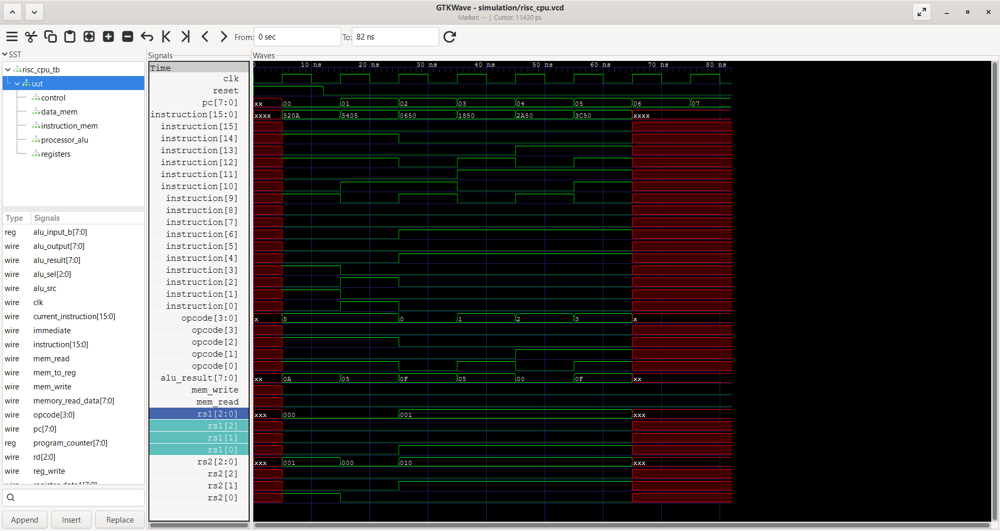

# 8-bit RISC Processor Design Using Verilog

## Overview

This project implements a simple **8-bit RISC processor** using Verilog HDL. The processor demonstrates the fundamental components of a CPU datapath, including instruction memory, a program counter, instruction decoding, register file, ALU, data memory, control logic, and write-back circuitry.

The design is simulated using **Icarus Verilog** and verified using **GTKWave** through waveform analysis.

## Features

* 8-bit processor datapath
* 16-bit instruction format
* 8-bit program counter
* 8-bit registers and ALU
* 8-register register file
* Instruction memory
* Data memory
* Combinational control unit
* Immediate operand support
* Memory read/write support
* ALU zero flag
* Verilog testbench-based verification
* VCD waveform generation for GTKWave

## Processor Architecture

The processor consists of the following major blocks:

```text
                    ┌────────────────────┐
                    │  Program Counter   │
                    └─────────┬──────────┘
                              │
                              ▼
                    ┌────────────────────┐
                    │ Instruction Memory │
                    └─────────┬──────────┘
                              │
                              ▼
                    ┌────────────────────┐
                    │ Instruction        │
                    │ Decoder / Control  │
                    └───────┬────────────┘
                            │
                ┌───────────┴───────────┐
                │                       │
                ▼                       ▼
       ┌────────────────┐      ┌────────────────┐
       │ Register File  │─────►│      ALU       │
       └────────────────┘      └───────┬────────┘
                ▲                       │
                │                       ▼
                │              ┌────────────────┐
                │              │  Data Memory   │
                │              └───────┬────────┘
                │                      │
                └──────── Write Back ──┘
```

## Instruction Format

The processor uses a **16-bit instruction**.

For register-based instructions, the instruction contains:

```text
┌────────┬────────┬──────┬──────┬──────┐
│ Opcode │   Rd   │ Rs1  │ Rs2  │  --  │
│ 4 bits │ 3 bits │3 bits│3 bits│3 bits│
└────────┴────────┴──────┴──────┴──────┘
```

The processor extracts:

* `opcode` → bits `[15:12]`
* `rd` → bits `[11:9]`
* `rs1` → bits `[8:6]`
* `rs2` → bits `[5:3]`

Immediate instructions use the lower instruction bits as an immediate value.

## Instruction Set

| Opcode | Instruction | Description                             |
| ------ | ----------- | --------------------------------------- |
| `0000` | ADD         | Add two registers                       |
| `0001` | SUB         | Subtract two registers                  |
| `0010` | AND         | Bitwise AND                             |
| `0011` | OR          | Bitwise OR                              |
| `0100` | XOR         | Bitwise XOR                             |
| `0101` | MOVI        | Move an immediate value into a register |
| `0110` | LOAD        | Load data from memory                   |
| `0111` | STORE       | Store register data into memory         |

## ALU Operations

The ALU provides eight selectable operations:

| ALU Select | Operation |
| ---------- | --------- |
| `000`      | ADD       |
| `001`      | SUB       |
| `010`      | AND       |
| `011`      | OR        |
| `100`      | XOR       |
| `101`      | NOT       |
| `110`      | Increment |
| `111`      | Decrement |

The ALU also generates a **ZERO flag** when the result is zero.

## Main RTL Modules

### `risc_cpu.v`

Top-level processor module integrating the complete datapath.

### `alu.v`

Performs arithmetic and logical operations.

### `control_unit.v`

Decodes the 4-bit opcode and generates the control signals required by the datapath.

### `register_file.v`

Provides register storage and register read/write operations.

### `instruction_memory.v`

Stores the processor instructions.

### `data_memory.v`

Provides data memory read and write functionality.

## Verification

The processor is verified using a Verilog testbench.

The current test program performs:

```text
MOVI R1, 10
MOVI R2, 5
ADD  R3, R1, R2
SUB  R4, R1, R2
AND  R5, R1, R2
OR   R6, R1, R2
```

### Expected Results

```text
R1 = 10
R2 = 5
R3 = 15
R4 = 5
R5 = 0
R6 = 15
```

The testbench compares the resulting register values with the expected values and reports whether the processor executed the instructions correctly.

## Simulation

The design was simulated using **Icarus Verilog**.

Example compilation:

```bash
iverilog -o simulation/risc_cpu_tb.vvp \
rtl/*.v tb/risc_cpu_tb.v
```

Run the simulation:

```bash
vvp simulation/risc_cpu_tb.vvp
```

The testbench also generates a VCD waveform:

```text
simulation/risc_cpu.vcd
```

The waveform can be inspected using GTKWave:

```bash
gtkwave simulation/risc_cpu.vcd
```

## Project Structure

```text
8-bit-RISC-Processor-Design-using-Verilog/
│
├── rtl/
│   ├── alu.v
│   ├── control_unit.v
│   ├── data_memory.v
│   ├── instruction_memory.v
│   ├── register_file.v
│   └── risc_cpu.v
│
├── tb/
│   ├── alu_tb.v
│   ├── register_file_tb.v
│   └── risc_cpu_tb.v
│
├── simulation/
│   ├── risc_cpu.vcd
│   └── risc_cpu_tb.vvp
│
├── screenshots/
│   └── gtkwave_verification.png
│
├── README.md
└── LICENSE
```
### GTKWave Verification

The processor waveform was analyzed using GTKWave. The waveform shows the clock, reset, program counter, instruction, ALU result, and write-back data during processor execution.



## Simulation Results

The testbench successfully verified the execution of the implemented instructions.

```text
======================================
        RISC CPU TEST RESULTS
======================================
R1 = 10
R2 = 5
R3 = 15
R4 = 5
R5 = 0
R6 = 15
======================================
RISC CPU SUCCESS: All instructions executed correctly!
======================================
```
## Tools Used

* **Verilog HDL**
* **Icarus Verilog**
* **GTKWave**
* **MSYS2 / UCRT64**
* **Git & GitHub**

## Learning Outcomes

This project provided practical experience with:

* RTL design using Verilog
* CPU datapath organization
* Instruction decoding
* Control signal generation
* Register-file design
* ALU implementation
* Memory interfacing
* Testbench development
* Digital simulation
* Waveform-based verification
* Git and GitHub version control

## Future Improvements

Possible extensions include:

* Additional instructions
* Branch and jump instructions
* Program memory initialization from external files
* Improved memory addressing
* More comprehensive automated verification
* Pipeline stages
* Hazard detection and forwarding
* FPGA implementation

## Author

**Vemuri Vidhya Madhavi**

Electronics and Telematics Engineering

---

*This project is intended as an educational RTL implementation demonstrating the fundamental concepts of a simple RISC processor.*

